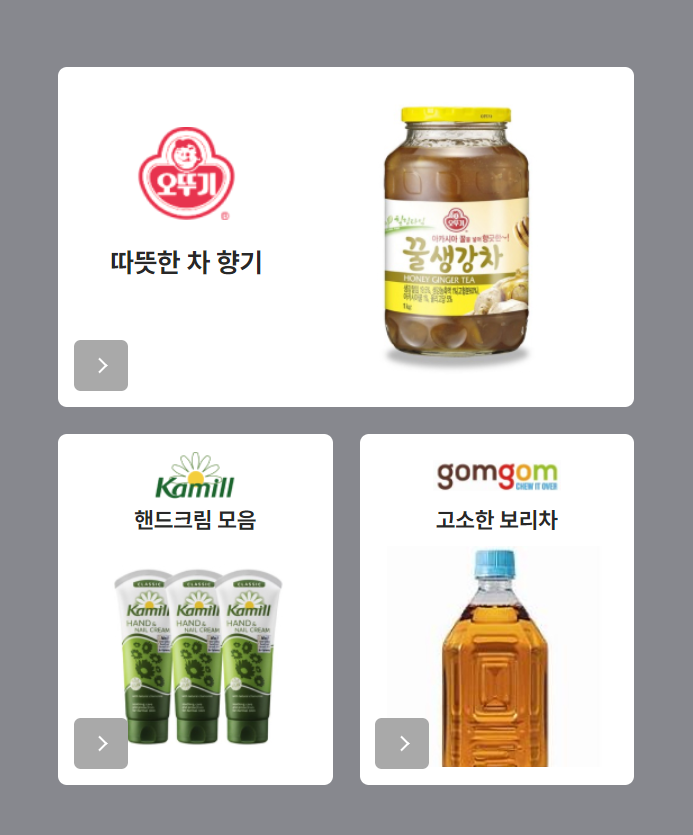
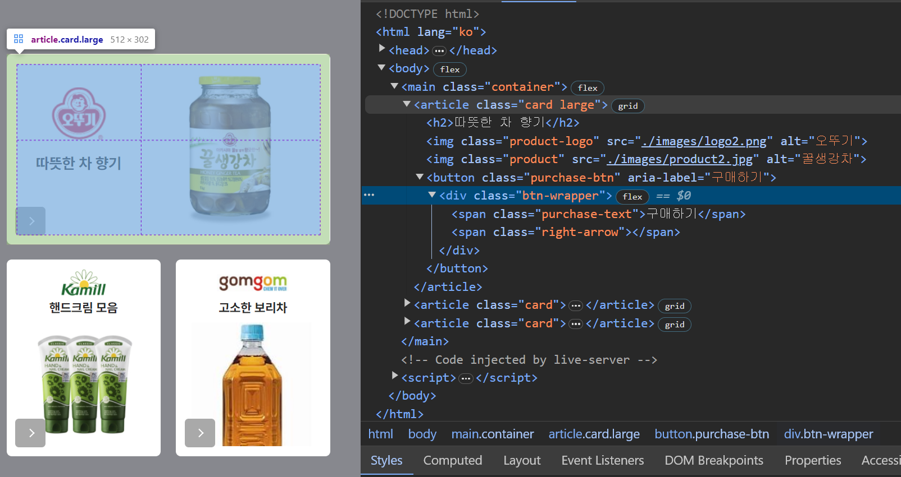
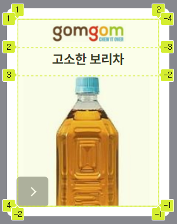
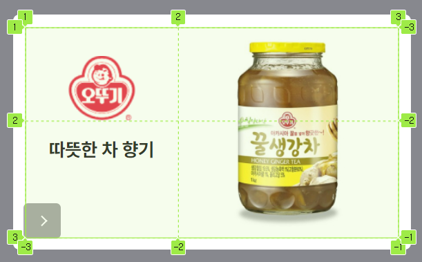
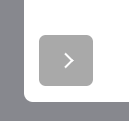
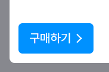

# MISSION 01

### Preview 이미지



<br>
<br>

# HTML

html 마크업은 아래의 구조로 작성했습니다.



아래의 두 카드(핸드크림, 보리차)도 같은 구조를 가지고있습니다..

### html 구조 설계

스크린 리더 사용자가 편하게 정보를 알 수 있게 설계하는 것이 이번 미션의 저의 목표였습니다.
그래서 아래와 같은 순서로 마크업을 설계했습니다. <br> <code><h4> \<h2> -> \ -> \ -> \<button> </code>
<br> <br> 제가 생각하기에 스크린 리더 사용자가 제목과 물건의 내용을 먼저 접한 다음,
각 상품의 정보를 이미지 alt 속성으로 전달받고, 구매하기 버튼으로 동선을 유도하는 것이 올바른 순서라고 생각해 이렇게 작성했습니다.

<br>
<br>

# CSS

공통 스타일을 지정한 다음, 모디파이어 클래스를 넣어서 수정하는 방식으로 만들었습니다.

### .Card

카드 기본 스타일은 그리드를 사용해 아이템을 배치하고 패딩을 줘서 전체 아이템이 8px 안쪽으로 들어가게 만들었습니다. <br>
긴 카드는 large라는 모디파이어 클래스를 넣어 <code> grid-template-areas</code>와 <code>width</code> 값을 변경했습니다.

<p>
  
  
</p>

```css
/* 기본 카드 스타일 */
.card {
  width: 244px;
  position: relative;
  padding: 16px;
  display: grid;
  align-items: flex-end;
  justify-items: center;
  grid-template-areas:
    "logo"
    "title"
    "product";
  grid-template-rows: 0.8fr 1fr;
  border-radius: 8px;
  background-color: white;
}
```

```css
/* 모디파이어 클래스 .large 스타일  */
.large {
  width: 100%;
  grid-template-areas:
    "logo product"
    "title product";
}
```

### .purchase-btn

포지션은 왼쪽 하단에 일정한 간격을 유지해서 놓기 위해, 속성으로 absolute 주고 left와 bottom으로 조정했습니다.




```css
.btn-wrapper {
  pointer-events: none;
  display: flex;
  justify-content: flex-end;
}

.purchase-btn {
  position: absolute;
  left: 14px;
  bottom: 14px;

  padding: 18px 14px;
  width: 48px;

  font-family: inherit;
  font-size: 18px;

  border-radius: 6px;

  overflow: hidden;

  color: white;
  background-color: #a9a9a9;

  cursor: pointer;
  transition: width 200ms cubic-bezier(0.215, 0.61, 0.355, 1), background-color
      200ms cubic-bezier(0.215, 0.61, 0.355, 1);
}

.purchase-text {
  position: absolute;
  top: 50%;
  left: 16px;
  white-space: nowrap;
  opacity: 0;
  transform: translateY(-50%) translateX(-80px);
  transition: opacity 0ms;
  transition-delay: 200ms ease;
}

.right-arrow {
  padding: 4px;

  border-bottom: 2px solid white;
  border-right: 2px solid white;

  transform: translateX(-6px) rotate(-45deg);
  -webkit-transform: translateX(-6px) rotate(-45deg);
}
```

<code>overflow: hidden</code> 과 <code>word-space: nowrap</code> hover 애니메이션이 나올 때 text가 안보이게 만들었습니다.
<br> 그리고 키보드 사용자를 위해 <code>focus-visible</code>을 따로 설정했습니다.

```css
.purchase-btn:hover {
  width: 112px;
  background-color: #0091ff;
}

.purchase-btn:focus-visible {
  width: 112px;
  background-color: #0091ff;
  outline: 3px solid orange;
  outline-offset: 3px;
}

.purchase-btn:hover .purchase-text,
.purchase-btn:focus-visible .purchase-text {
  opacity: 1;
  transform: translateY(-50%);
}
```
