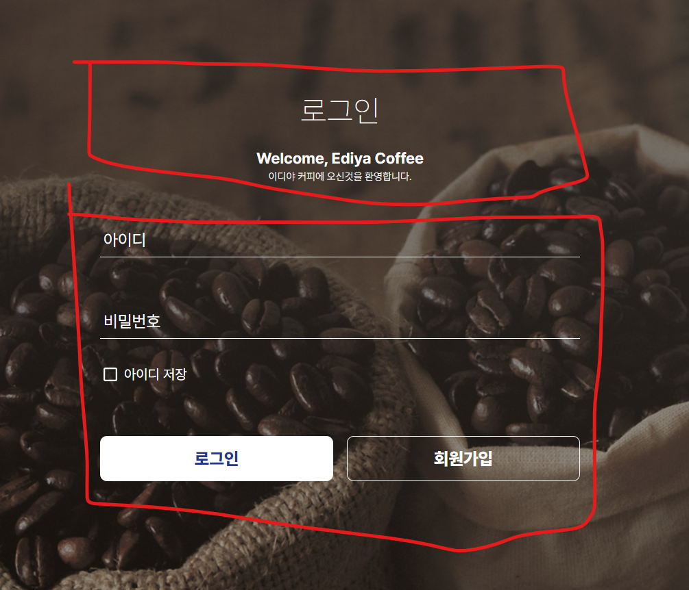
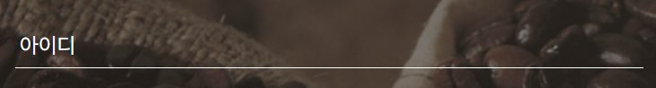
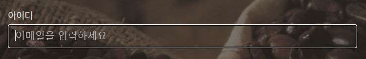
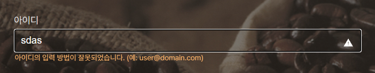
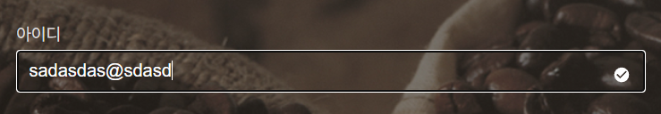
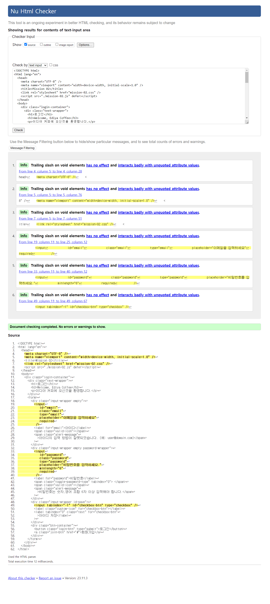

# 로그인 창 구현

### [Mission2 Demo](https://jsweetpotato.github.io/home-work/mission-02/mission-02.html)

## overview

- [마크업](#마크업)
- [CSS](#css)
- [Validate HTML](#validate-html)

<br>
<br>

# 마크업



두 개의 구역으로 분리

```html
<div class="login-container">
  <div class="title-wrapper"></div>
  <form></form>
</div>
```

<br>

타이틀 박스를 만들고, h1 -> h3 -> p 로 만듬

```html
<div class="title-wrapper">
  <h1>로그인</h1>
  <h3>Welcome, Ediya Coffee</h3>
  <p>이디야 커피에 오신것을 환영합니다.</p>
</div>
```

<br>
비밀번호 길이 최소6 설정, <code>required</code> 속성 추가,
불필요한 버튼 엘리먼트를 만드는 대신 <code>&lt;span&gt;</code> 태그에 <code>tabindex=0</code> 속성을 넣음

```html
<div class="input-wrapper empty password-wrapper">
  <input
    id="password"
    class="password"
    type="password"
    placeholder="비밀번호를 입력하세요."
    minlength="6"
    required
  />
  <label for="password">비밀번호</label>
  <span class="toggle-password-type" tabindex="0"> </span>
  <span class="valid-icon"></span>
  <span class="alert-message"
    >비밀번호는 숫자,영어 조합 6자 이상 입력해야 합니다.</span
  >
</div>
```

<br>

커스텀 체크박스 사용때문에 <code>&lt;input&gt;</code>은 <code>tabindex=-1</code>, 텍스트가 있는 <code>&lt;label&gt;</code>에 <code>tabindex=0</code>을 줌

```html
<div class="input-wrapper id-save">
  <input tabindex="-1" id="checkbox-btn" type="checkbox" />
  <label class="custom-icon" for="checkbox-btn"></label>
  <label tabindex="0" for="checkbox-btn">아이디 저장</label>
</div>
```

<br>

로그인 버튼은 폼 제출용 <code>&lt;button&gt;</code>으로, 회원가입 버튼은 다른 페이지로 이동한다 판단해 <code>&lt;a&gt;</code>태그 사용

```html
<div class="btn-container">
  <button class="login-btn" type="submit">로그인</button>
  <a class="join-btn" href="#">회원가입</a>
</div>
```

<br>
<br>
<br>

# CSS

최대한 공통 속성으로 묶어서 사용하고, 인풋 아이콘은 부모 엘리먼트에 상태클래스를 줘서 변경

### 상태 결과 미리보기

기본 상태 (empty)


focus 상태


invalid 상태


valid 상태


```css
/* 이메일, 패스워드 */
.email + label,
.password + label {
  transition: 100ms ease-in;
  transform: translate(4px, -14px);
}

/* 이메일, 패스워드 라벨*/
.email:focus + label,
.password:focus + label,
.input-wrapper:not(.empty) .email + label,
.input-wrapper:not(.empty) .password + label {
  color: #dfdfdf;
  transform: scale(0.8) translate(-8px, -250%);
}

/* validation icon */
.valid-icon {
  content: "";
  position: absolute;
  display: inline-block;
  top: 25%;
  right: 8px;
  width: var(--icon-box-size);
  height: var(--icon-box-size);
  background: no-repeat center / var(--icon-image-size);
}
/* valid 상태 */
.valid .valid-icon {
  background-image: url("./assets/check.svg");
}
/* invalid 상태 */
.invalid .valid-icon {
  background-image: url("./assets/warn.svg");
}
/* empty 상태 */
.empty .valid-icon {
  background-image: none;
}
```

<br>

패스워드 또한 위의 상태를 기본으로 포함하고, 패스워드 텍스트 보이게 만드는 버튼도 부모 엘리먼트의 상태와 패스워드 인풋 상태를 조합해서 javascript와 css로 만듬

```css
/* 패스워드 보기 아이콘 기본 속성 */
.toggle-password-type {
  position: absolute;
  display: inline-block;
  width: var(--icon-box-size);
  height: var(--icon-box-size);
  top: 25%;
  right: 32px;
  background: no-repeat center / var(--icon-image-size);
  background-image: url("./assets/eye-open.svg");
}
```

```css
/* .empty 상태 .passwoord-wrapper에 포커스 엘리먼트가 없으면 visibility: hidden */
.empty .toggle-password-type,
.password-wrapper:not(:focus-within) .toggle-password-type {
  visibility: hidden;
}
```

```css
/* 인풋 상태가 변하면 패스워드 보기 아이콘의 background-image 변경 */
.password[type="password"] ~ .toggle-password-type {
  background-image: url("./assets/eye-open.svg");
}
.password[type="text"] ~ .toggle-password-type {
  background-image: url("./assets/eye-close.svg");
}
```

<br>
media qeury 반응형 설정

```css
@media (min-width: 540px) {
  .btn-container {
    grid-template-columns: 1fr 1fr;
  }
  .login-container {
    justify-content: center;
    gap: 40px;
  }

  form {
    gap: 20px;
  }

  input {
    font-size: 1.125rem;
  }

  .btn-container {
    margin-top: 40px;
  }
}
```

<br>
<br>
<br>

# Validate HTML


